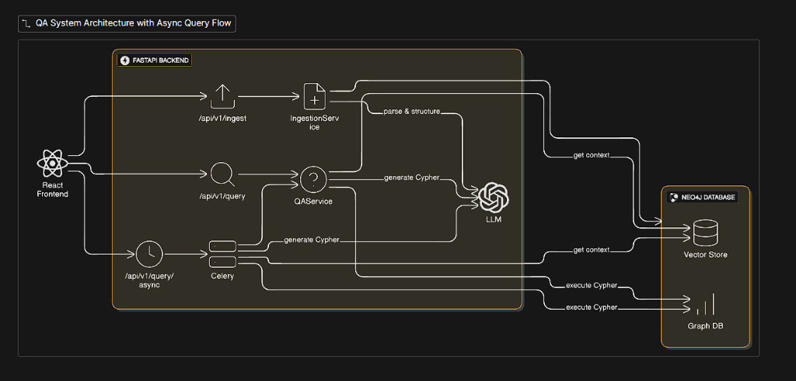

# Neo4j Knowledge Base with LangChain

A full-stack AI-powered Knowledge Base application that enables natural language queries on graph data. Built with Neo4j, LangChain, FastAPI, and React.

## 🎯 What This Project Does

Ask questions in plain English like:
- "Find Python experts in Engineering"
- "Show me all active projects"
- "Who are the Software Engineers?"
- "List employees with React skills"

The AI translates your questions into Cypher queries, executes them on Neo4j, and returns human-readable answers.

## 🏗️ Architecture



## ✨ Features

### Backend (FastAPI + LangChain)
- **Natural Language Processing** - Ask questions in plain English
- **GraphCypherQAChain** - AI-powered Cypher query generation
- **Multi-LLM Support** - Works with Groq and OpenAI
- **RESTful API** - 10+ endpoints for data access
- **Production Logging** - Structured logging with rotation
- **Type Safety** - Full Pydantic validation
- **CORS Enabled** - Frontend integration ready

### Frontend (React + TypeScript)
- **5 Interactive Pages** - Query, Employees, Projects, Departments, Analytics
- **Modern UI** - ShadCN components with Tailwind CSS
- **Real-time Search** - Filter and search across all data
- **Data Visualization** - Charts with Recharts
- **Responsive Design** - Works on all screen sizes

### Knowledge Base
- **100 Employees** - Names, titles, departments, skills, salaries
- **50 Projects** - Status, budget, priority, team assignments
- **81 Skills** - Programming, Cloud, Data, Testing categories
- **20 Clients** - Industries, revenue, contracts
- **8 Departments** - Engineering, Data Science, DevOps, etc.
- **1,400+ Relationships** - HAS_SKILL, WORKS_ON, REPORTS_TO, etc.

## 🚀 Quick Start

### Prerequisites
- Python 3.10+
- Node.js 18+
- Neo4j Database (local or cloud)

### 1. Clone & Setup Backend

```bash
git clone https://github.com/Kamal2131/langchain_neo4j.git
cd langchain_neo4j

# Create virtual environment
python -m venv .venv
.venv\Scripts\activate  # Windows
source .venv/bin/activate  # Linux/Mac

# Install dependencies
pip install -r requirements.txt
```

### 2. Configure Environment

Create `.env` file:

```env
# Neo4j
NEO4J_URI=bolt://localhost:7687
NEO4J_USERNAME=neo4j
NEO4J_PASSWORD=your_password

# LLM Provider (choose one)
LLM_PROVIDER=groq
GROQ_API_KEY=your_groq_api_key

# Or use OpenAI
# LLM_PROVIDER=openai
# OPENAI_API_KEY=your_openai_api_key
```

### 3. Load Sample Data

```bash
# Generate fake company data
python scripts/generate_fake_data.py

# Load into Neo4j
python scripts/load_large_kb.py
```

### 4. Start Backend

```bash
python -m uvicorn src.main:app --reload
```

Backend runs at: http://localhost:8000

### 5. Setup Frontend

```bash
cd frontend
npm install
npm run dev
```

Frontend runs at: http://localhost:5173

## 📁 Project Structure

```
neo4j/
├── src/                      # Python backend
│   ├── api/routes/           # API endpoints
│   │   ├── health.py         # Health checks
│   │   ├── query.py          # NL query endpoint
│   │   └── company.py        # Data endpoints
│   ├── core/                 # Configuration
│   │   ├── config.py         # Settings
│   │   ├── logging.py        # Logging setup
│   │   └── exceptions.py     # Custom exceptions
│   ├── services/             # Business logic
│   │   ├── qa_service.py     # LangChain QA
│   │   └── neo4j_service.py  # Database service
│   └── main.py               # FastAPI app
│
├── frontend/                 # React frontend
│   ├── src/
│   │   ├── components/       # UI components
│   │   ├── pages/            # Route pages
│   │   ├── lib/              # API client
│   │   └── types/            # TypeScript types
│   └── package.json
│
├── scripts/                  # Utility scripts
│   ├── generate_fake_data.py # Data generator
│   └── load_large_kb.py      # Data loader
│
├── data/                     # Generated data
│   └── generated_kb_data.json
│
├── tests/                    # Test suite
└── requirements.txt          # Python dependencies
```

## 🔌 API Endpoints

### Health
| Method | Endpoint | Description |
|--------|----------|-------------|
| GET | `/api/v1/health` | Health check |
| GET | `/api/v1/health/schema` | Database schema |

### Natural Language Query
| Method | Endpoint | Description |
|--------|----------|-------------|
| POST | `/api/v1/query` | Ask a question |
| GET | `/api/v1/query/examples` | Sample questions |

### Company Data
| Method | Endpoint | Description |
|--------|----------|-------------|
| GET | `/api/v1/company/employees` | List employees |
| GET | `/api/v1/company/projects` | List projects |
| GET | `/api/v1/company/departments/stats` | Department stats |
| GET | `/api/v1/company/skills/{name}/experts` | Find skill experts |

## 💬 Sample Questions

```
"Show me all active projects"
"List employees in the Engineering department"
"Who are the Software Engineers?"
"Find employees with Python skills"
"What projects are in planning stage?"
"Show me all DevOps Engineers"
"List employees in Data Science department"
"Who has React skills?"
```

## 🛠️ Tech Stack

### Backend
- **FastAPI** - Modern Python web framework
- **Neo4j** - Graph database
- **LangChain** - LLM orchestration
- **Groq/OpenAI** - LLM providers
- **Pydantic** - Data validation

### Frontend
- **React 18** - UI library
- **TypeScript** - Type safety
- **Vite** - Build tool
- **Tailwind CSS v4** - Styling
- **ShadCN UI** - Component library
- **TanStack Query** - Data fetching
- **Recharts** - Charts
- **React Router** - Navigation

## 📊 Graph Schema

```
(:Employee)-[:WORKS_IN]->(:Department)
(:Employee)-[:HAS_SKILL]->(:Skill)
(:Employee)-[:WORKS_ON]->(:Project)
(:Employee)-[:REPORTS_TO]->(:Employee)
(:Project)-[:REQUIRES]->(:Skill)
(:Project)-[:FOR_CLIENT]->(:Client)
(:Project)-[:HAS_DOCUMENT]->(:Document)
```

## ⚙️ Configuration

### Environment Variables

| Variable | Description | Default |
|----------|-------------|---------|
| `NEO4J_URI` | Neo4j connection URI | `bolt://localhost:7687` |
| `NEO4J_USERNAME` | Database username | `neo4j` |
| `NEO4J_PASSWORD` | Database password | Required |
| `LLM_PROVIDER` | LLM provider (groq/openai) | `groq` |
| `GROQ_API_KEY` | Groq API key | Required if using Groq |
| `OPENAI_API_KEY` | OpenAI API key | Required if using OpenAI |
| `DEBUG` | Enable debug mode | `false` |

## 🧪 Testing

```bash
# Run tests
pytest

# With coverage
pytest --cov=src
```

## 📦 Deployment

### Docker

```bash
docker-compose up -d
```

### Manual

1. Set environment variables
2. Run `uvicorn src.main:app --host 0.0.0.0 --port 8000`
3. Build frontend: `cd frontend && npm run build`
4. Serve frontend with nginx or similar

## 🔧 Development

```bash
# Backend with auto-reload
python -m uvicorn src.main:app --reload

# Frontend dev server
cd frontend && npm run dev

# Lint Python
ruff check src/

# Lint Frontend
cd frontend && npm run lint
```

## 📈 Use Cases

- **HR Analytics** - Find employees by skills, department, experience
- **Project Management** - Track project status, team assignments, budgets
- **Skill Mapping** - Identify experts, skill gaps, training needs
- **Organizational Insights** - Understand reporting structure, team composition

## 🤝 Contributing

1. Fork the repository
2. Create feature branch (`git checkout -b feature/amazing`)
3. Commit changes (`git commit -m 'Add amazing feature'`)
4. Push to branch (`git push origin feature/amazing`)
5. Open a Pull Request

## 📞 Support

For issues or questions, open a GitHub issue or contact the maintainers.

---

**Built with ❤️ using Neo4j, LangChain, FastAPI, and React**
